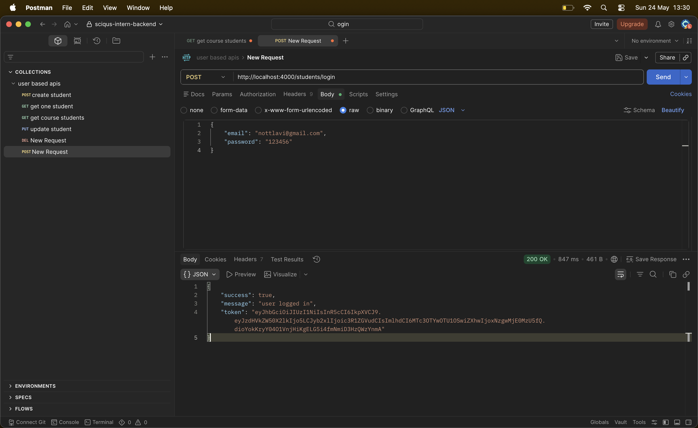
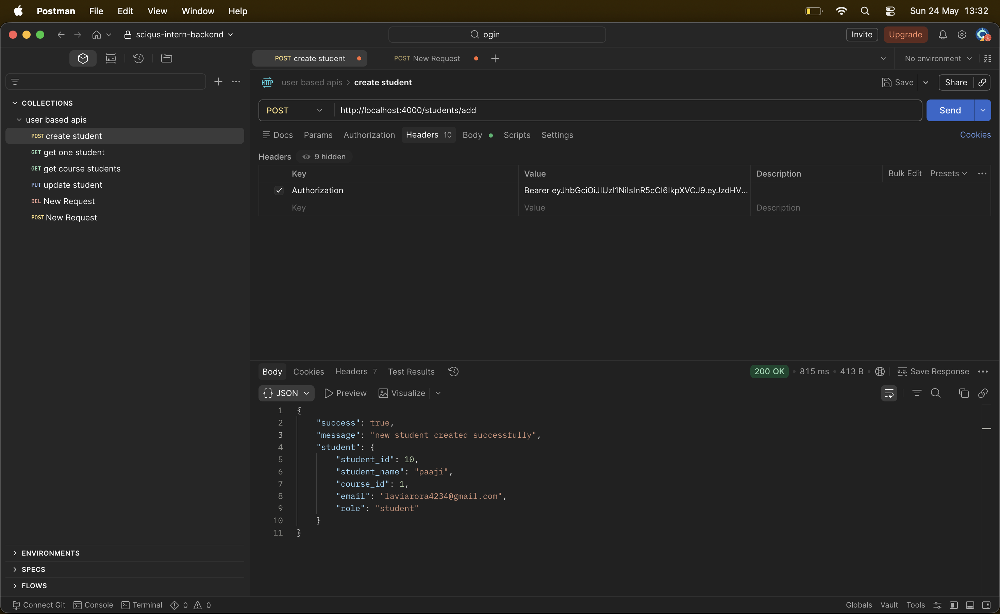
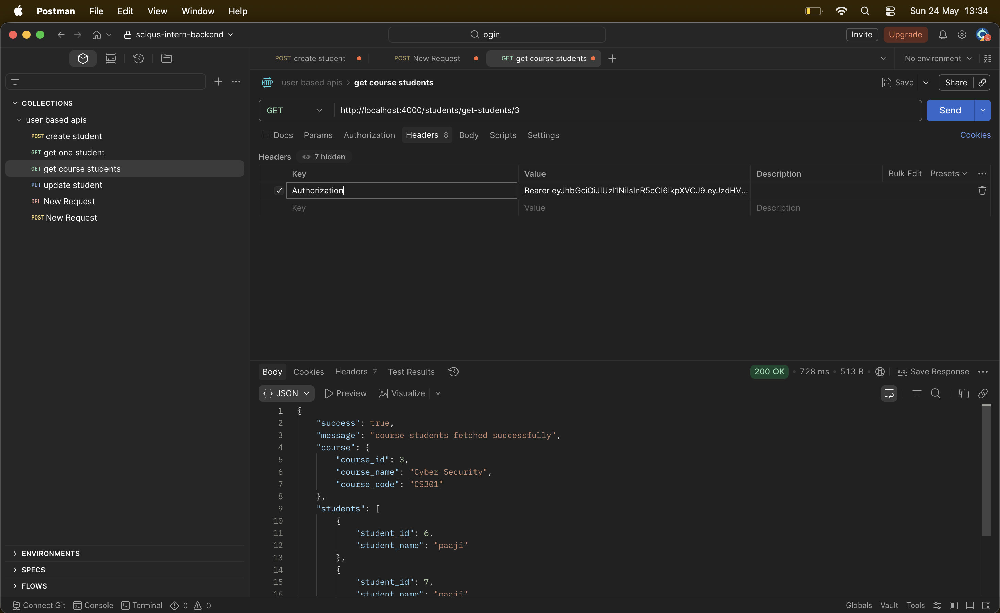
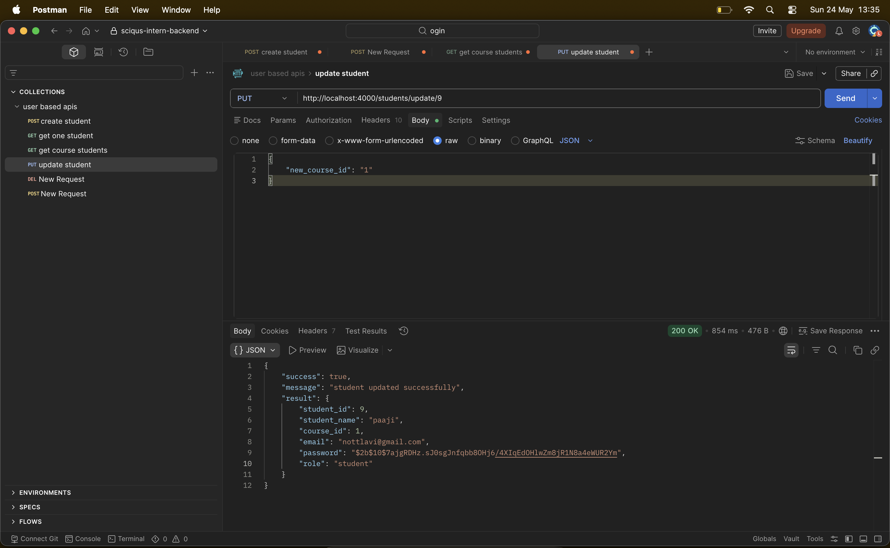
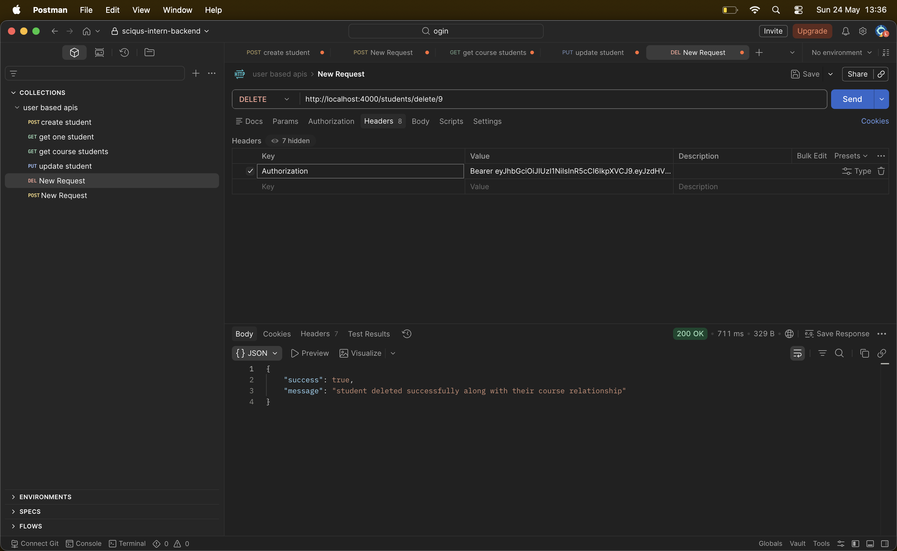
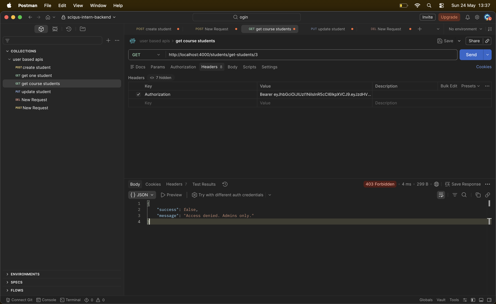

# Student and Course Management Backend
This is a backend project built for the Sciqus internship assessment.  
The project manages students and their associated courses using PostgreSQL and Express.js.
## Tech Stack
- Node.js
- Express.js
- PostgreSQL
- Supabase
- JWT Authentication
- bcrypt
---
# Features Implemented
## Student Management
- Create Student
- Get Student Details
- Get Students Enrolled in a Course
- Update Student Details
- Delete Student
## Course Management
- Course table with relational mapping
- Foreign key relationship between students and courses
## Authentication & Authorization
- JWT based authentication
- Admin role protection
- Student/Admin role system
---
# Project Setup
## 1. Clone Repository
```bash
git clone <your-repo-url>
cd sciqus-intern-backend

⸻

2. Install Dependencies

npm install

⸻

3. Create .env File

Create a .env file in the root directory.

Example:

PORT=4000
DATABASE_URL=your_postgresql_connection_url
JWT_SECRET=your_secret_key

⸻

4. Run the Server

Development mode:

npm run dev

Production mode:

npm start

⸻

Database Schema

Courses Table

CREATE TABLE courses (
    course_id SERIAL PRIMARY KEY,
    course_name VARCHAR(255),
    course_code VARCHAR(100) UNIQUE,
    course_duration INTEGER
);

⸻

Students Table

CREATE TABLE students (
    student_id SERIAL PRIMARY KEY,
    student_name VARCHAR(255),
    email VARCHAR(255) UNIQUE,
    password VARCHAR(255),
    role VARCHAR(20) DEFAULT 'student',
    course_id INTEGER REFERENCES courses(course_id)
);

⸻

Role Constraint

ALTER TABLE students
ADD CONSTRAINT valid_role
CHECK (role IN ('admin', 'student'));

⸻

Sample Course Data

INSERT INTO courses (course_name, course_code, course_duration)
VALUES
('MERN Stack', 'MERN101', 6),
('Data Science', 'DS201', 8),
('Cyber Security', 'CS301', 12);

⸻

API Endpoints

Authentication

Login

POST /students/login

⸻

Student Routes

Create Student (Admin Only)

POST /students/add

Get Student Details

GET /students/get/:student_id

Get Students by Course

GET /students/get-students/:course_id

Update Student

PUT /students/update/:student_id

Delete Student

DELETE /students/delete/:student_id

⸻

Authentication Flow

* User logs in using email and password
* JWT token is generated after successful login
* Token must be passed in Authorization headers

Example:

Authorization: Bearer your_jwt_token

⸻

Authorization

Admin

Can:

* Create students
* Update students
* Delete students
* Access all routes

Student

Can:

* View their own details
* View course information

⸻

Notes

* Passwords are hashed using bcrypt before storing in database.
* PostgreSQL parameterized queries are used to prevent SQL injection.
* Foreign key constraints are used for relational integrity.
* No stored procedures were used in this implementation.
* Transaction management was skipped as it was optional in the assignment.

⸻

Testing

API testing was done using Postman.

---

# API Testing Screenshots

## Login API
JWT token generation after successful login.



---

## Create Student API
Creating a new student with course assignment.



---

## Get Student Details API
Fetching students details along with associated course information.



---

## Update Student API
Updating student details and modifying course assignment.



---

## Delete Student API
Deleting a student record successfully.



---

## Authorization Check
Attempting to access admin-only route without admin privileges.


